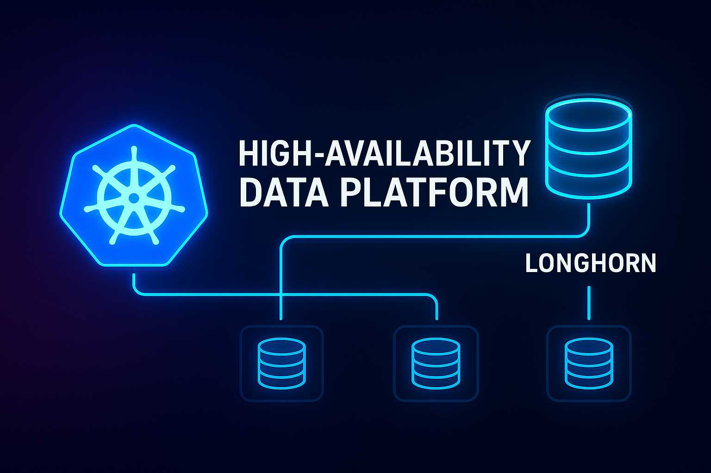
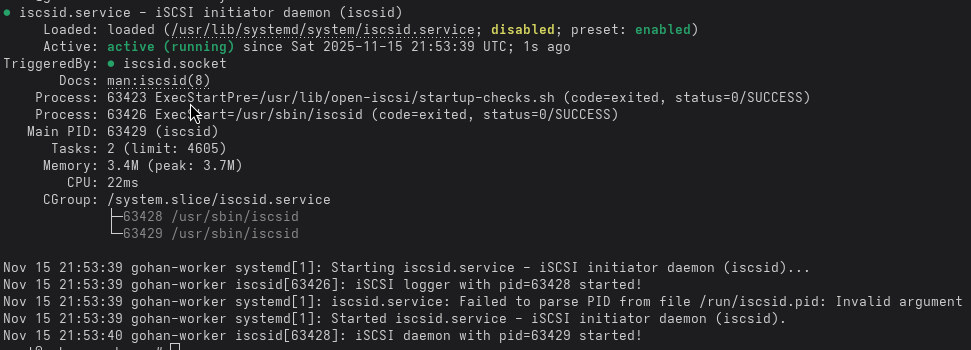
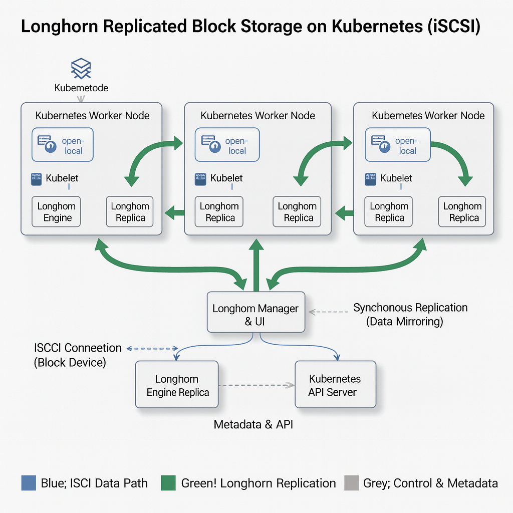

###### **THIS PROJECT IS UNDER CONSTRUCTION YET.**
<h2 align="center" style="font-weight: 900;">
  ⚙️ High-Availability Data Platform on Kubernetes with Longhorn
</h2>
<p align="center">
  
</p>

<p align="center">    </p>
Highly Available (HA) Data Platform on Kubernetes. Implementation of a Software-Defined Storage (Longhorn)  solution to ensure persistence and high availability for stateful applications (e.g., PostgreSQL) within a local K8s cluster.

### 📂 Directory Structure (GitOps Ready)
***
This well-organized structure clearly separates application code, infrastructure configuration, and orchestration layers, adhering to **modern GitOps principles**.

```text
/
├── k8s/
│   ├── base/
│   │   └── postgres/
│   │       ├── postgres-secret.yaml           # Base K8s Manifests
│   │       └── postgres-statefulset.yaml
│   │
│   └── longhorn/ 
│       └── base/
            └── values.yaml                    # Longhorn Helm/Configuration
│
├── kustomize/
│   └── base/
│       └── kustomization.yaml                 # Kustomize Entry Point (Points to k8s/base)
│
├── docs/                                      # 🏗️ Documentation
│   ├── ARCHITECTURE.md
│   └── OPERATIONS.md
│
└── README.md


```

### 💾 Kubernetes Persistent Storage with Longhorn (iSCSI Setup)

This document details the prerequisite steps for configuring host nodes to support Longhorn, a distributed block storage system for Kubernetes.

---
### 🛠️ Prerequisite: Open-iSCSI Client Installation

This essential step ensures the host systems can communicate with and mount Longhorn volumes, enabling network-based volume replication and high availability.

| Command | Scope | Description |
| :--- | :--- | :--- |
| `sudo apt update` | **Per Worker Node** | Refreshes the package index to ensure current versions. |
| `sudo apt install open-iscsi -y` | **Per Worker Node** | Installs the iSCSI client for mounting Longhorn volumes as local disks. |
| `sudo systemctl status iscsid` | **Per Worker Node** | Confirms the iSCSI daemon is running (`active (running)`). |

### Installation Verification

To confirm the successful installation and status of the iSCSI service:

<p align="justify">

</p>

---

### 📝 Storage Architecture and Best Practices (Longhorn)

#### Architectural Overview

The diagram below illustrates the high-level integration of Longhorn, demonstrating how it leverages the iSCSI client on each worker node for persistent volume access and cross-node data replication.

---

<p align="justify">
  
</p>

#### Current Implementation and Resource Allocation

The current deployment utilizes the host's existing disks, requiring a minimum of **62 GB of available free space** per worker node to accommodate Longhorn volume replicas. For demonstration purposes, the root partition (`/var/lib/longhorn`) is currently designated for storage.

### ⚠️ Production Best Practice:

* **While the current setup is adequate for proof-of-concept and demonstration environments, the **industry-standard best practice** for a **Production** environment is to provision a **dedicated physical disk or partition** for Longhorn storage on each node.**
---

#### Rationale for Dedicated Storage:

* **Performance Isolation (IOPS):** Separating Longhorn's potentially I/O-intensive storage from the host operating system's disk ensures consistent performance for both application workloads and OS stability.
* **System Stability:** This design minimizes potential resource contention and prevents I/O spikes generated by Longhorn from impacting core operating system functions.**
* **Architectural Stability (Production Only):** This design consideration is crucial for maintaining **stability and high performance** in a robust production data platform.
---
### 🚀 Deploying the Data Application with Kustomize (Method A: `Kustomize`)
* **Use Kustomize to orchestrate and apply the base PostgreSQL manifests (StatefulSet, Service, Secrets) defined in the project structure, along with the Longhorn Helm chart defined in the kustomization.yaml file.**
---
### A. Executing the Main Deployment
 * **Execution Rationale:** ***The `kubectl apply -k` command runs Kustomize directly, reading the `kustomization.yaml` file at the specified path to deploy all defined resources (PostgreSQL and Longhorn).***
---
### Execute Kustomize from the project root, pointing to the kustomize/ directory.
* **This will deploy the PostgreSQL StatefulSet, Longhorn (via Helm), and associated components.**

```bash
kubectl apply -k kustomize/
```
---
### 2. Verify the Pod deployment status.
```bash
kubectl get pods -n demo-app -l db=postgres
```
---
### B. Expected Output Example
* **After execution, Kubernetes will begin creating the resources, and the PostgreSQL Pod should reach the Running and Ready (1/1) state.**
```bash
NAME         READY   STATUS    RESTARTS   AGE
postgres-0   1/1     Running   0          30s
```
---
### 🚀 3. Longhorn Installation (Method B: Helm) 🚢
* **While Kustomize handles the data application deployment, it is highly recommended to use Helm for installing and managing the Longhorn distributed storage addon, as its charts manage the underlying infrastructure efficiently.**
---

### A. Helm Repository Preparation

These commands prepare your local environment to locate the official Longhorn charts.

* **1. Add the official Longhorn repository:** `helm repo add longhorn https://charts.longhorn.io` — Adds the official URL to enable chart discovery.
* **2. Update local repositories:** `helm repo update` — Fetches the latest list of charts and versions for all configured repositories.

### Terminal Output Example
To ensure the repositories are ready:

---

### B. Install the Longhorn Controller

We will install Longhorn in its own dedicated namespace (`longhorn-system`) using Helm.


```bash
helm install longhorn longhorn/longhorn --namespace longhorn-system --create-namespace

```
---

### ✅ Phase 1: Longhorn Functional Verification
We must ensure that the Longhorn controller is ready to provision storage and that your nodes are registered.

### A. Verify Node Installation
Longhorn must detect your worker nodes and enable them for storage.

**Your Task:**

1.  Use `kubectl` to view the custom resources (CRD) for `nodes.longhorn.io`.
2.  Verify that the status (`Ready`) of the detected nodes is **True**.

**Guide Command:**

```bash
# This command is helpful for checking the Longhorn Node CRD:
kubectl get nodes.longhorn.io -n longhorn-system

```
---
```bash
# This command is helpful for checking the pods longhorn is running --> Important:
kubectl get pods -n longhorn-system
```
### B. Verify the StorageClass
---
Longhorn creates a default StorageClass that we'll use for our database.

**Your Task:**

1.  Verify that the StorageClass named **longhorn** exists in your cluster.
2.  Confirm that it is marked as the **default** or be aware that you will reference it explicitly.

**Guide Command:**

```bash
kubectl get sc
```
---
### 🖥️ C. Access the UI (Optional, but Recommended)
---
**Objective:** Access the Longhorn Web UI to visually confirm that all your nodes are **available** and have the expected **free space** (the 62 GB you confirmed).

**▶️ Execution Command (for Local Access):**

```bash
# This command forwards the Longhorn service port to your local machine:
kubectl port-forward svc/longhorn-frontend 8080:80 -n longhorn-system
```
⚠️ **IMPORTANT:** Once the command is running, **open your web browser** and navigate to the following address: 
 
 [**http://localhost:8080**](http://localhost:8080)
 
 ---

 ### 💾 2. Node Failure Simulation and Persistence (HA Test)

This section verifies the **High Availability (HA)** of your PostgreSQL service. It ensures that **Longhorn** correctly detaches and re-attaches the persistent volume to the replacement Pod without any data loss during a node failure simulation.

---
### 2.1. ⚙️ Longhorn Replica Pre-Configuration (Critical)

To ensure Longhorn volumes do not enter a **Degraded** state in small or limited clusters (e.g., a cluster with only two worker nodes), it is essential to adjust the default replica count.

By default, Longhorn uses **3 replicas** (`numberOfReplicas: 3`). If you only have two Worker nodes, the volume will constantly be marked as degraded because the third replica cannot be placed, compromising your redundancy.

### Action: Update the Replica Count

You should modify the `StorageClass` or define the replica count directly in your `VolumeClaimTemplates`.

* **If you are using a custom StorageClass (Recommended):**
    Ensure the `numberOfReplicas` parameter in your `longhorn` StorageClass is set equal to the number of available Worker nodes (e.g., `2`).

* **If you are managing it within the StatefulSet (as in your configuration):**

    ```yaml
    volumeClaimTemplates:
      - metadata:
          name: postgres-data
        spec:
          accessModes: [ "ReadWriteOnce" ]
          storageClassName: "longhorn"
          # If necessary, ensure parameters are set to match your node count
          # Note: If the volume already exists with 3 replicas, you must manually 
          # update it in the Longhorn UI or via kubectl patch.
          resources:
            requests:
              storage: 5Gi
    ```

---
### 💥 Simulate Node Failure

#### 2.2 ✍️ Write a Test Data Point

### Identify the PostgreSQL pod
```bash
export POSTGRES_POD=$(kubectl get pods -n demo-app -l db=postgres -o jsonpath='{.items[0].metadata.name}')
```
---
### Create data point to prove persistence.

```bash
# Create table on postgres.
kubectl exec -it -n demo-app "$POSTGRES_POD" -- \
  psql -U postgres-user -d postgres-db -c "
  CREATE TABLE IF NOT EXISTS longhorn_Table_testing (
    id INT PRIMARY KEY,
    info TEXT
  );
  "
echo ">> Table Created successfully"

# Insert data on table.
kubectl exec -it -n demo-app "$POSTGRES_POD" -- \
  psql -U postgres-user -d postgres-db -c "
  INSERT INTO longhorn_Table_testing (id, info)
  VALUES (1, 'DATA_STORAGE_LONGHORN')
  ON CONFLICT (id) DO NOTHING;
  COMMIT;
  "

echo ">> Test data inserted successfully"
```
---
### 2.3 We will force the eviction of the PostgreSQL Pod, compelling Kubernetes to move it, which will trigger Longhorn's recovery mechanism.

```bash
# 1. Identify the current node hosting the DB (assuming $POSTGRES_POD is exported)
export NODE_TO_FAIL=$(kubectl get pod -n demo-app "$POSTGRES_POD" -o jsonpath='{.spec.nodeName}')
echo ">> Current Node: $NODE_TO_FAIL"
```
---

### 2.4 Drain the node: This marks the node as unschedulable and evicts the pods.
💡 kubectl drain Command Options
| Option | Purpose | | :--- | :--- | | --ignore-daemonsets | Prevents eviction of Pods managed by DaemonSets. This is crucial for leaving essential components like Longhorn (CSIs, Managers) and networking Pods (CNI, e.g., Calico, Cilium, etc.) active on the node being drained. | | --delete-emptydir-data | Allows the deletion of Pods that utilize emptyDir volumes, acknowledging that this data will be lost. | | --force | Forces the termination of Pods that are not managed by a higher-level controller. This is necessary to successfully evict Pods belonging to StatefulSets (like your PostgreSQL Pod). |
```bash
echo ">> Draining the node to simulate the failure..."
kubectl drain "$NODE_TO_FAIL" --ignore-daemonsets --delete-emptydir-data --force
```
---

### 2.5 🧪 Validation of Recovery and Data Persistence

Following the node drainage, Kubernetes is expected to have successfully rescheduled the PostgreSQL Pod onto an alternative, healthy Worker node. **Longhorn** must then seamlessly execute the volume migration by detaching the **Persistent Volume (PV)** from the failed node and re-attaching it to the new Pod's host, thus enabling database recovery.

### 2.6 Monitoring Pod Rescheduling

The first step in validation is to confirm the successful relocation and readiness of the PostgreSQL Pod on the new host.

```bash
# 1. Initiate a wait condition until the replacement PostgreSQL Pod reports a 'Ready' status.
echo "Awaiting the successful rescheduling and readiness of the new PostgreSQL Pod..."
kubectl wait --for=condition=Ready pod -n demo-app -l db=postgres --timeout=300s

# 2. Extract the name of the newly running Pod and its corresponding Node.
export NEW_POSTGRES_POD=$(kubectl get pods -n demo-app -l db=postgres -o jsonpath='{.items[0].metadata.name}')
export NEW_NODE=$(kubectl get pod -n demo-app "$NEW_POSTGRES_POD" -o jsonpath='{.spec.nodeName}')

echo ">> New PostgreSQL Pod Identity: **$NEW_POSTGRES_POD**"
echo ">> New Host Node: **$NEW_NODE**"
```
---
### 2.7 Identify the new PostgreSQL pod and node 
```bash
export NEW_POSTGRES_POD=$(kubectl get pods -n demo-app -l db=postgres -o jsonpath='{.items[0].metadata.name}')
export NEW_NODE=$(kubectl get pod -n demo-app "$NEW_POSTGRES_POD" -o jsonpath='{.spec.nodeName}')
echo ">> New PostgreSQL Pod: **$NEW_POSTGRES_POD**"
echo ">> New Node: **$NEW_NODE**"
```
## 2.8. Data Integrity Verification 💾
* **The final step is to execute a database query against the recovered Pod to confirm that the transactional data written prior to the node failure remains persistent and accessible, thus validating the entire High Availability mechanism.**

```bash
# Execute a SELECT query on the recovered Pod instance to retrieve the test record.
echo "Initiating verification query..."

kubectl exec -it -n demo-app "$POSTGRES_POD" -- \
  psql -U postgres-user -d postgres-db -c "
    SELECT * FROM longhorn_Table_testing;
  "
echo ">> Rows selected successfully"

✔️ Expected Output:

 id |         info          
----+-----------------------
  1 | DATA_STORAGE_LONGHORN
(1 rows)

```
---
### 🔄 2.9 Reverting the Node Drain (Returning the Cluster to Normal State)
* **After successfully completing the failover simulation and verifying the system's high availability, you must re-enable the drained node so it can accept Pods again. Kubernetes marks the node as cordoned (unschedulable), so this state needs to be reverted.**
---
👉 `Uncordon`: This command returns the node to a Schedulable state, allowing Kubernetes to resume scheduling Pods on node.

```bash
echo ">> Re-enabling the node after HA test..."
kubectl uncordon "$NODE_TO_FAIL"

✔️ Expected Output: `node/worker-node-a uncordoned`
```
---
### ✅ High Availability Test Summary (Total Success!) 🚀

The High Availability test successfully confirmed that **Longhorn** correctly managed the volume migration during a simulated node failure, ensuring service continuity and data integrity for the PostgreSQL StatefulSet.

| Step | Result |
| :--- | :--- |
| **Data Written** | `DATA_STORAGE_LONGHORN` written. |
| **Simulated Failure** | Node **`worker-node-a`** drained. |
| **HA Activated** | Pod `postgres-0` migrated to **`worker-node-b`**. |
| **Persistence Verified** | Data successfully recovered. |

